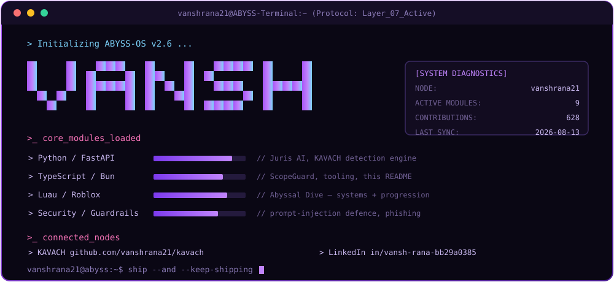

<!--
  ⚠️  DO NOT EDIT README.md DIRECTLY — it is generated.
  Edit this file (README.template.md) instead, then either push
  (the workflow rebuilds it) or run locally:  bun scripts/build-readme.ts
-->

<!-- wrapped in an anchor on purpose: GitHub auto-links any bare image to its
     blob page, so clicking the banner would jump to the raw SVG file. -->

  

## Hi, I'm Vansh 👋

`vanshrana21` · he/him · Mumbai, India

I'm a 1st-year Computer Engineering student who mostly learns by shipping things that
have to survive contact with real users. Right now that means an AI legal-study platform,
a code-quality CLI, a co-op Roblox game, and a backtester I built because I got tired of
taking trading advice on faith.

I like problems where the boring engineering *is* the product — the phishing detector
below won its hackathon not because the model was clever, but because it ran live inside
Gmail instead of sitting in a slide deck.

- 🏆 **Won TCS Tech Day** with KAVACH
- 🔭 Currently building **Juris AI** and **ScopeGuard**
- 🌱 Learning my way around Docker, GitHub Actions, and Luau
- 💬 Ask me about FastAPI, Bun, Roblox systems design, or backtesting Indian equities
- 📫 **vanshrana2137@gmail.com** · [LinkedIn](https://www.linkedin.com/in/vansh-rana-bb29a0385/)

---

## 🚀 What I'm building

<table>
<tr><td width="33%" valign="top">

### 🛡️ KAVACH
**🏆 Winner — TCS Tech Day**

AI phishing detector that scans mail *in place* via a browser extension for Gmail and
WhatsApp — flagging messages as you read them, not after you've already clicked.

[`→ source`](https://github.com/vanshrana21/kavach) · `Python` `FastAPI` `Chrome Extension`

</td><td width="33%" valign="top">

### ⚖️ Juris AI
**In active development**

Study platform for law students — courtroom simulation, answer-writing practice with
automated scoring, and institution dashboards.

[`→ source`](https://github.com/vanshrana21/Ieee) · `FastAPI` `SQLAlchemy` `Alembic`

</td><td width="33%" valign="top">

### 🧭 ScopeGuard
**In active development**

CLI that scores AI-generated code for quality drift — so the thing you vibe-coded at 2am
gets caught before it ships.

`TypeScript` `Bun`

</td></tr>
<tr><td valign="top">

### 📈 nse-lab
**Personal research**

Backtester for NSE equity strategies. Built after a stock-picker idea didn't survive its
own numbers — now every idea gets tested before I believe it.

`Python` `pandas`

</td><td valign="top">

### 🌊 Abyssal Dive
**In development**

Co-op extraction boss-battler in Roblox — descend through three ocean zones, fight what's
down there, and get back to the surface with your haul.

`Luau` `Roblox Studio`

</td><td valign="top">

### 🤖 Project Friday
**Experiment**

A personal-assistant experiment — the project where I learned how much of an assistant is
plumbing rather than intelligence.

[`→ source`](https://github.com/vanshrana21/Project-Friday) · `TypeScript` `Firebase`

</td></tr>
</table>

---

## 🧰 Skills

<table>
<tr>
<th align="left">I build with</th>
<th align="left">I'm learning</th>
<th align="left">I've shipped with</th>
</tr>
<tr valign="top">
<td>

</td>
<td>

</td>
<td>

</td>
</tr>
</table>

**Open every day:**

---

## 📊 My GitHub, live

🔥 &nbsp;**725** contributions in the last year  
📦 &nbsp;**714** commits · **1** PRs · **0** issues  
📁 &nbsp;**10** public repos · ⭐ **9** stars earned  
👥 &nbsp;**4** followers · **2** following  
🗓️ &nbsp;On GitHub since **May 2025**

### Everything that's public

| Repo | What it is | Built with | Last pushed |
|---|---|---|---|
| **[daily-pulse](https://github.com/vanshrana21/daily-pulse)** | 📈 Self-updating daily snapshot of my public GitHub footprint — GitHub Action + GraphQL API, rewrites its own README | `TypeScript` | today |
| **[claude-os-free](https://github.com/vanshrana21/claude-os-free)** | _no description yet_ | `TypeScript` `Python` `JavaScript` `CSS` `Shell` | 6 days ago |
| **[AbyssalDive](https://github.com/vanshrana21/AbyssalDive)** ⭐ 1 | 🌊 Co-op extraction boss-battler on Roblox — descend through three ocean zones, fight what's down there, and surface with your haul. Script layer + rebuild scripts. | `Lua` `Luau` | 18 days ago |
| **[kavach](https://github.com/vanshrana21/kavach)** ⭐ 1 | 🏆 TCS Tech Day winner — AI phishing detector that scans Gmail & WhatsApp live in your browser, with an on-device Privacy Shield mode | `HTML` `Python` `JavaScript` | 18 days ago |
| **[Ieee](https://github.com/vanshrana21/Ieee)** ⭐ 2 | Juris AI — AI study platform for law students: courtroom simulation, answer-writing practice with automated scoring, and institution dashboards | `Python` `JavaScript` `CSS` `HTML` `Shell` | 18 days ago |
| **[Finguru](https://github.com/vanshrana21/Finguru)** ⭐ 1 | Finance-literacy tutoring chatbot — FastAPI backend with a vanilla JS frontend | `CSS` `HTML` `JavaScript` | 6 months ago |
| **[hackathon-1](https://github.com/vanshrana21/hackathon-1)** ⭐ 1 | Full-stack hackathon build — vanilla JS frontend on a Python backend | `JavaScript` `HTML` `CSS` `Python` | 6 months ago |
| **[Project-Friday](https://github.com/vanshrana21/Project-Friday)** ⭐ 1 | Project Friday — personal AI assistant experiment (TypeScript + Firebase, Python backend) | `TypeScript` `Python` `CSS` `JavaScript` `HTML` | 9 months ago |

☝️ This table builds itself from the GitHub API every day — stars and dates are always current.

---

## 🐍 Watch the snake eat my commits

<picture>
  <source media="(prefers-color-scheme: dark)" srcset="https://raw.githubusercontent.com/vanshrana21/vanshrana21/output/github-contribution-grid-snake-dark.svg" />
  <source media="(prefers-color-scheme: light)" srcset="https://raw.githubusercontent.com/vanshrana21/vanshrana21/output/github-contribution-grid-snake.svg" />
  
</picture>

---

## 🎧 Outside the editor

When I'm not shipping, I'm building maps in **Roblox Studio**, reading NSE charts (research
only — I don't let a bot near a live order), or doing **print design work for my dad's
clients** — which is where I learned that "just export it as PNG" is never the answer.

---

🤖 This README rebuilds itself daily from the GitHub API — last updated **26 Aug 2026, 8:47 am IST**

